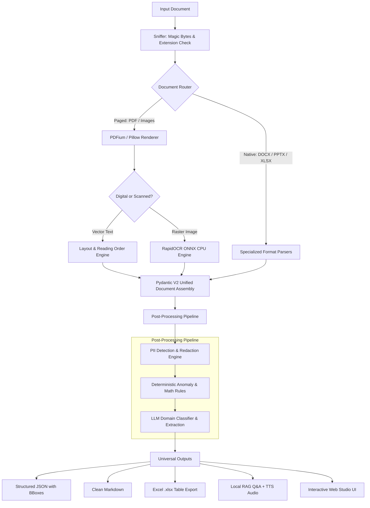
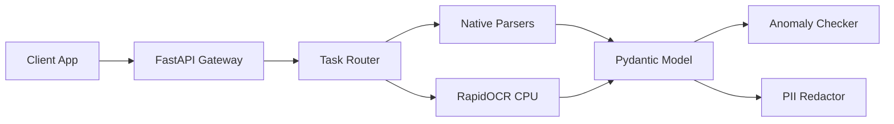

# ParseAnything 🚀
### *Universal High-Fidelity Document Ingestion & Semantic Understanding Engine*

[](https://www.python.org/downloads/)
[](https://fastapi.tiangolo.com/)
[](https://onnxruntime.ai/)
[](https://ollama.com/)
[](#-license--compliance)
[](#-design-philosophy--enterprise-readiness)

---

## 📌 Overview

**ParseAnything** is an open-source, privacy-first universal document ingestion engine built for high-stakes enterprise workflows and autonomous AI pipelines. It bridges the gap between unstructured, multi-format files and structured downstream applications (LLMs, RAG vectors, data warehouses) by extracting layout-aware semantic structures with bounding-box coordinate provenance.

From complex digital PDFs and scanned documents to spreadsheets, slide decks, legacy Office files, and emails, **ParseAnything converts raw documents into strictly validated JSON + Markdown with zero cloud dependencies.**

> **Hackathon Track:** *DataQuest 3.0 — Universal Document Ingestion Engine*  
> **Core Value Proposition:** 100% permissive open-source stack, deterministic math verification, local CPU-only OCR execution, native PII redaction, and domain-specialized analytical dashboards.

---

## 📑 Table of Contents

- [The Problem vs. The Solution](#-the-problem-vs-the-solution)
- [Key Features](#-key-features)
- [Supported Formats Matrix](#-supported-formats-matrix)
- [System Architecture & Pipeline](#-system-architecture--pipeline)
- [Repository Structure](#-repository-structure)
- [Quick Start Guide](#-quick-start-guide)
- [CLI Reference](#-cli-reference)
- [REST API Reference](#-rest-api-reference)
- [Unified Document Schema](#-unified-document-schema)
- [Spotlight: Advanced Engineering Mode](#-spotlight-advanced-engineering-mode)
- [Design Philosophy & Enterprise Readiness](#-design-philosophy--enterprise-readiness)
- [License & Compliance](#-license--compliance)

---

## 💡 The Problem vs. The Solution

| Challenge in Traditional Ingestion | How ParseAnything Solves It |
| :--- | :--- |
| **Monolithic, Fragile Parsers** that break across different file extensions | **Smart Magic-Byte Sniffer + Router** directing files to dedicated format handlers |
| **External Binary Hell** (requiring local Tesseract.exe installs) | **Embedded RapidOCR ONNX CPU** running 100% inside Python without external binaries |
| **Lost Tabular Geometry & Merged Cells** flattening rows into nonsense | **Heuristic Table Reconstructor** preserving row/col spans + 1-click Excel export |
| **Cloud Cost & Data Privacy Leaks** sending sensitive documents to external APIs | **100% Local Execution** with Presidio PII redaction and local Ollama inference |
| **Silent Parsing Errors & Bad OCR Figures** polluting RAG knowledge bases | **Deterministic Anomaly Engine** flagging table math mismatches and broken page sequences |

---

## ✨ Key Features

### 1. 📄 Universal Multimodal Parsing
- Ingests **PDFs (native & scanned), DOCX, XLSX, PPTX, CSV, HTML, TXT, and MSG/EML**.
- Automatically differentiates between digital vector text and rasterized scanned pages using density analysis.

### 2. 👁️ 100% CPU-Ready Vision & RapidOCR
- Runs high-accuracy text recognition via ONNX Runtime on standard CPU hardware.
- No heavy GPU or CUDA requirements; zero external system package installations needed.

### 3. 🧱 Typed Semantic Blocks with Spatial Provenance
- Outputs 13 distinct typed block primitives: `heading`, `paragraph`, `list`, `table`, `figure`, `chart`, `equation`, `code`, `caption`, `header`, `footer`, `footnote`, and `other`.
- Every block retains page index, reading order sequence, and bounding-box geometry (`[x0, y0, x1, y1]`).

### 4. 📊 Complex Table Reconstruction & Excel Re-Export
- Recovers multi-row headers, irregular grids, and merged cells.
- Exports tables directly to formatted multi-sheet `.xlsx` workbooks with source references.

### 5. 🛡️ Enterprise PII Detection & Sensitive Data Redaction
- Built-in detection for sensitive patterns including **Aadhaar, PAN cards, emails, credit cards, and API secrets**.
- Supports both **masking** (`XXXX-XXXX-1234`) and **reversible pseudonymization**.

### 6. 🔍 Deterministic Anomaly & Math Validation Engine
- Evaluates document sanity using pure deterministic rules:
  - **TableMathRule:** Automatically calculates column/row summations and flags math discrepancies.
  - **MissingPageRule:** Detects skipped or missing page number sequences.
  - **ConfidenceRule:** Highlights OCR segments falling below confidence thresholds.

### 7. 🧠 Autonomous Domain Intelligence
- LLM-powered domain classifier categorizes documents into **Financial, Legal, Engineering, or General**.
- Extracts domain-tailored key-value schemas and structured facts.

### 8. 💬 Grounded Local RAG & Semantic Search
- Powered by local Ollama (`llama3`) for zero-data-leak Q&A.
- Semantic search finds answers and returns verbatim quotes for visual on-page highlighting.
- Automatically suggests contextual follow-up questions for uploaded documents.

### 9. 🎙️ Executive Simplification & Local Text-to-Speech (TTS)
- Rewrites complex legal/technical jargon into Plain English summaries with preamble cleanup.
- Offline audio playback for accessibility and rapid executive briefing.

### 10. 🎨 Modern Dual-Theme Web Studio
- Clean, responsive split-screen web interface featuring both dark and light modes.
- Visual block explorer, raw JSON/Markdown inspector, Excel downloader, and interactive Mermaid.js diagram viewer.

---

## 📊 Supported Formats Matrix

| Format | Extension | Parser Engine | Capabilities |
| :--- | :--- | :--- | :--- |
| **PDF (Digital)** | `.pdf` | `pypdfium2` + Layout heuristics | Vector text, reading order, headings, tables, metadata |
| **PDF (Scanned)** | `.pdf` | `RapidOCR ONNX` | Image binarization, CPU OCR, bounding boxes |
| **Word Documents**| `.docx` | `python-docx` | Headings, styled runs, lists, embedded tables |
| **Excel Sheets**  | `.xlsx`, `.xls` | `openpyxl` / `pandas` | Multi-sheet parsing, formula evaluation, cell coordinates |
| **Presentations** | `.pptx` | `python-pptx` | Slide hierarchy, shapes, text boxes, presentation tables |
| **Delimited Data**| `.csv`, `.tsv` | `pandas` | Delimiter auto-detection, schema typing |
| **Web & Markup**  | `.html`, `.md` | `BeautifulSoup4` | DOM element traversal, markdown AST preservation |
| **Email Messages**| `.eml`, `.msg` | `extract-msg` / `email` | Headers, sender/receiver, timestamps, body formatting |
| **Raster Images** | `.png`, `.jpg`, `.jpeg` | `RapidOCR` + `Pillow` | Standalone image text & table detection |

---

## 🛠️ System Architecture & Pipeline



---

## 📂 Repository Structure

```
ParseAnything/
│
├── parseanything/              # Core Python package
│   ├── api/                    # FastAPI server, CORS, endpoints, job queue
│   ├── cli/                    # Typer & Argparse command-line interface
│   ├── core/                   # Sniffer, router, and page orchestrator
│   ├── formats/                # Format handlers (PDF, DOCX, XLSX, PPTX, CSV, etc.)
│   ├── pdf/                    # PDF rendering, layout heuristics, block segmenter
│   ├── ocr/                    # RapidOCR ONNX backend execution
│   ├── sensitive/              # PII detection (Presidio, regex) and redaction
│   ├── anomalies/              # Table math rules, sequence checks, confidence flags
│   ├── domains/                # Domain classifier and extraction schemas
│   ├── retrieval/              # Local vector store, question generation, RAG
│   ├── llm/                    # Local Ollama backend connector and simplifier
│   ├── exporters/              # Multi-sheet Excel (.xlsx) exporter
│   ├── tts/                    # Local Text-to-Speech synthesis
│   ├── config.py               # Centralized configuration options
│   └── schema.py               # Universal Pydantic V2 Document & Block schemas
│
├── ui/                         # Modern responsive Web Studio
│   ├── index.html              # Studio interface with Dark/Light theme
│   ├── style.css               # Studio stylesheet
│   └── app.js                  # Client logic, Mermaid.js rendering, API connectors
│
├── docs/                       # Architecture plans, handoff guides, and specifications
├── tests/                      # Comprehensive test suite (unit & integration)
├── Dockerfile                  # Container definition for portable deployment
├── docker-compose.yml          # Container composition
└── pyproject.toml              # Build specifications and dependencies
```

---

## 🚀 Quick Start Guide

### 1. Prerequisites
- **Python:** Version `3.11` or higher recommended.
- **Operating System:** Windows, macOS, or Linux (fully platform-agnostic).
- **Ollama (Optional, for LLM features):** [ollama.com](https://ollama.com) installed locally.

### 2. Installation

```bash
# 1. Clone the repository
git clone https://github.com/Srivastava23/ParseAnything.git
cd ParseAnything

# 2. Set up a virtual environment
python -m venv .venv

# On Windows:
.venv\Scripts\activate
# On Linux / macOS:
source .venv/bin/activate

# 3. Install dependencies
pip install -r requirements.txt
pip install -e .
```

### 3. Launch the Web Studio & API Server

Start the backend API server. The Web Studio frontend is automatically served at the root URL:

```bash
python parseanything/cli/main.py serve --port 8000
```
> Open your browser at **`http://127.0.0.1:8000/`** to access the interactive Web Studio!

### 4. Enable Local LLM (Optional for Chat & Domain Extraction)

To use document Q&A, Plain English simplification, and engineering domain mapping:

```bash
# Start the Ollama background daemon
ollama serve

# Pull the lightweight, high-performance model
ollama pull llama3
```

---

## 💻 CLI Reference

ParseAnything provides a clean command-line interface for batch processing and headless pipelines:

```bash
# Basic parsing: generate both JSON and Markdown
parseanything parse path/to/document.pdf --out ./output_dir

# Export only Markdown
parseanything parse report.docx --out ./output_dir --format md

# Process with multiple parallel workers
parseanything parse data_sheet.xlsx --out ./output_dir --workers 8

# Run with VLM features disabled for ultra-fast throughput
parseanything parse scanned_form.png --out ./output_dir --no-vlm

# Start the API server via CLI
parseanything serve --host 127.0.0.1 --port 8000
```

---

## 🌐 REST API Reference

The FastAPI service provides fully documented endpoints accessible at `http://127.0.0.1:8000/docs`:

| Method | Endpoint | Description |
| :--- | :--- | :--- |
| `GET` | `/` or `/ui` | Serves the interactive Web Studio interface |
| `GET` | `/health` | Health-check endpoint returning server operational status |
| `POST` | `/parse` | Primary multipart ingestion endpoint (`file`, `format`, `redact`, `domain`) |
| `POST` | `/to-markdown` | Converts an existing Pydantic Document payload into formatted Markdown |
| `POST` | `/export/xlsx` | Extracts all tables from a Document into a formatted `.xlsx` workbook |
| `POST` | `/anomalies` | Runs deterministic rules (math sum checks, missing pages, OCR flags) |
| `POST` | `/redact` | Detects and masks/pseudonymizes sensitive PII data |
| `POST` | `/simplify` | Uses local LLM to rewrite complex text into Plain English |
| `POST` | `/next-questions` | Generates 5 high-context follow-up exploration questions |
| `POST` | `/answer` | Answers user questions grounded in document context with confidence scores |
| `POST` | `/search-document` | Semantic search returning matched passages and verbatim quotes |
| `POST` | `/tts` | Synthesizes document narrative into downloadable speech audio |
| `POST` | `/compare-engineering` | Compares two document revisions and outputs architectural changes |

---

## 📐 Unified Document Schema

Every file parsed by ParseAnything adheres to a universal schema defined in `parseanything/schema.py`.

<details>
<summary><b>🔍 Click to expand Document Schema structure and example</b></summary>

```json
{
  "schema_version": "1.0.0",
  "document_id": "doc_9f81a742",
  "metadata": {
    "filename": "quarterly_financials.pdf",
    "file_type": "pdf",
    "file_size": 2048576,
    "created_at": "2026-10-08T13:00:00Z"
  },
  "stats": {
    "pages": 4,
    "blocks": 42,
    "flagged_blocks": 1,
    "elapsed_s": 0.84,
    "pages_per_sec": 4.76
  },
  "pages": [
    {
      "number": 1,
      "width": 612.0,
      "height": 792.0,
      "blocks": [
        {
          "id": "blk_001",
          "type": "heading",
          "content": "Q3 Financial Summary",
          "bbox": {"x0": 54.0, "y0": 72.0, "x1": 350.0, "y1": 96.0},
          "reading_order": 1,
          "confidence": 0.99
        },
        {
          "id": "blk_002",
          "type": "table",
          "table": {
            "n_rows": 3,
            "n_cols": 3,
            "header_rows": 1,
            "cells": [
              {"row": 0, "col": 0, "text": "Segment", "is_header": true},
              {"row": 0, "col": 1, "text": "Revenue (M)", "is_header": true},
              {"row": 1, "col": 0, "text": "Cloud Services", "is_header": false},
              {"row": 1, "col": 1, "text": "$420.5", "is_header": false}
            ],
            "markdown": "| Segment | Revenue (M) |\n| :--- | :--- |\n| Cloud Services | $420.5 |"
          }
        }
      ]
    }
  ],
  "analysis": {
    "domain": "financial",
    "anomalies": [],
    "auto_redacted": false
  }
}
```

</details>

---

## ⚡ Spotlight: Advanced Engineering Mode

When an engineering design document, architecture plan, or incident report is ingested, ParseAnything automatically activates **Advanced Engineering Mode**:



- **Interactive Mermaid.js Architecture Diagrams:** Renders system components, queues, and dependency graphs visually.
- **API & Database Extraction:** Extracts route paths, schemas, and relational entities into structured tables.
- **Incident & RCA Timelines:** Constructs chronological event logs and severity metrics.
- **Revision Diffing (`/compare-engineering`):** Compares architecture versions to surface newly added endpoints, deprecated systems, or breaking schema changes.

---

## 🔒 Design Philosophy & Enterprise Readiness

1. **Zero Cloud Spend & 100% Privacy by Design:**  
   Document intelligence shouldn't require sending proprietary trade secrets or sensitive PII to third-party cloud APIs. All extraction, OCR, and reasoning can run completely air-gapped on standard workstation or server CPUs.

2. **Decoupled Architecture:**  
   Every parser format, OCR backend, anomaly validator, and LLM connector is registered via an extensible plugin protocol. New formats or custom domain rules can be added in minutes without altering core pipeline logic.

3. **Defensive Ingestion:**  
   Windows file-lock safety, zip memory decompression checks, and graceful fallbacks guarantee the engine won't crash when encountering corrupted files, broken page numbering, or unexpected formats.

---

## 📜 License & Compliance

This project is released under the **Apache 2.0 / MIT** license.

- **Zero AGPL Contamination:** Safe for commercial enterprise deployment and hackathon submission.
- **Dependencies:** Built on permissive libraries (`pypdfium2`, `python-docx`, `openpyxl`, `RapidOCR`, `FastAPI`).

---

<div align="center">
  <sub>Built with ❤️ for <b>DataQuest 3.0</b>. Star this repository if you find it useful!</sub>
</div>
